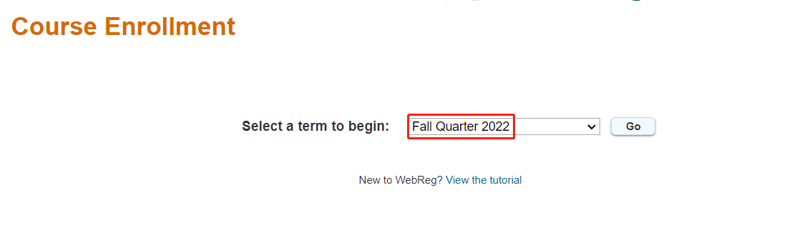

# UCSD WebReg Bot🤖
This is an automated web program for UCSD's online course enrollment system ([webreg](https://act.ucsd.edu/webreg2)).

## Warning
This program is still in its experimental stage\
⚠️USE AT YOUR OWN RISK⚠️

## What can it do
* Constantly refreshing webreg to check if there are new seats avaliable
* Go backwards to the "go" page to ensure the page is refreshed
* Automatically enroll the class if there is vacancy
* Enroll multiple courses
* Timer for specific duration (developing)


## Prerequisities
* [Python 3.x](https://www.python.org/downloads/)
* Selenium
```pip install selenium```
* openpyxl
```pip install openyxl```
* Web Driver (Best to use [Chrome](https://chromedriver.storage.googleapis.com/index.html))\
  Notice to download the correspond driver version that is the same as your browser version and replace the existing one.

## How does it work
1. Put your UCSD username & password in B1 and B2 cell inside ```config.xlsx```
2. Check your webreg and record all courses you like to enroll\
   Format as same as below
   
   
|   |   |   |   |   |   |
|---|---|---|---|---|---|
| Username | Name Here | --- | --- | --- | --- |
| Password | PW Here | --- | --- | --- | --- |
| MMW16 | 12345 | 12346 | 12347 | 12348 | ...... |
| MMW17 | 024680 | 024681 | 024682 | 024683 | ...... |

> **Notice**\
> There is no space between the letters and numbers of courses\
> No need to add 0 before numbers as it is a hard thing to do in xlsx files

3. Run the bot.py file
4. Prepare to authorize SSO login
5. Leave the program running
6. When the bot finds a vacancy for a class, it will enroll automatically and an email notification will be send to your email.
7. When all classes are enrolled, the program exists itself
